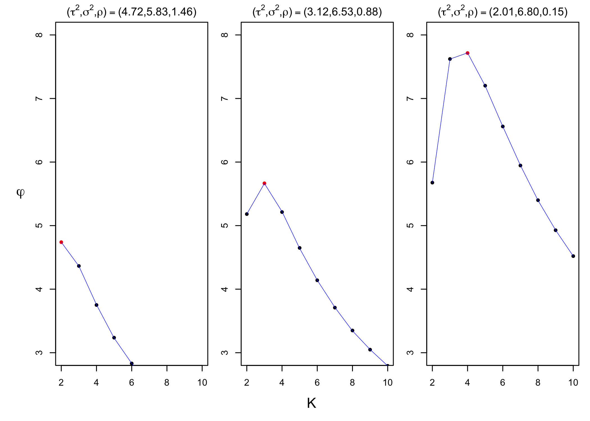

## Best intratumor heterogeneity association study design

This document reproduces parts of numerical studies presented in the
best intratumor heterogeneity (ITH) association study [paper]().
Specifically, we will

1.  simulate (binary) multiregion genomic data,
2.  estimate parameters that will be used to find optimal designs, and
3.  find optimal designs for pre-collection and post-collection
    scenarios for given estimated parameters.

All of the functions appearing in this document are in
$\texttt{functions.R}$.

### Generate multiregion genomic datasets

We simulate multiregion genomic data to estimate three parameters,
$\tau^2, \sigma^2$ and $\rho$. These parameters will be used to find
optimal designs in the later section. The function `simulate_tumors()`
generates a list of matrix, each of them representing a multiregion
genomic data for one tumor (corresponding to one subject). Required
inputs are

- number of tumors (`nTumors`)
- number of samples for each tumor (`nSamp`)
- number of genes (or probes, copy number segments and etc.) (`nSeg`)
- underlying mutation rate of a patient (`mutationRates`) which will be
  used to generate underlying mutation status vector
- lower bound of the uniform distribution from which $\theta$ will be
  drawn
- upper bound of the uniform distribution from which $\theta$ will be
  drawn

$\theta$ controls ITH where $\theta = 1$ corresponds to no ITH, and
$\theta = 0.5$ corresponds to maximum possible ITH. The following code
chunk generates multiregion genomic data of 50 tumors. The columns
represent samples and rows represent gene’s mutation status.

``` r
nTumors <- 50
nSamp <- 10
nSeg <- 40
theta_lb <- 0.5
theta_ub <- 0.6
mutationRates <- rbeta(nSeg,2,3)

set.seed(1)
tumor_mat_list <- simulate_tumors(nTumors=nTumors,nSamp=nSamp,nSeg=nSeg,
                                  mutationRates=mutationRates,
                                  theta_lb=theta_lb,theta_ub=theta_ub)
tumor_mat_list[[1]]
```

    ##       s1 s2 s3 s4 s5 s6 s7 s8 s9 s10
    ##  [1,]  0  0  0  0  0  0  0  0  0   0
    ##  [2,]  0  0  0  0  0  0  0  0  0   0
    ##  [3,]  0  1  0  0  1  1  0  0  1   0
    ##  [4,]  0  1  0  1  0  1  0  1  1   0
    ##  [5,]  0  0  0  0  0  0  0  0  0   0
    ##  [6,]  1  1  0  1  1  0  1  1  1   0
    ##  [7,]  1  1  1  0  0  1  0  1  1   1
    ##  [8,]  0  0  0  0  0  0  0  0  0   0
    ##  [9,]  1  1  1  0  1  0  1  1  1   1
    ## [10,]  0  0  0  0  0  0  0  0  0   0
    ## [11,]  1  1  1  0  0  1  1  0  1   1
    ## [12,]  0  0  0  0  0  0  0  0  0   0
    ## [13,]  0  0  1  1  0  0  1  1  0   1
    ## [14,]  0  0  0  0  0  0  0  0  0   0
    ## [15,]  0  0  1  0  1  1  0  0  0   1
    ## [16,]  0  0  0  0  0  0  0  0  0   0
    ## [17,]  0  0  0  0  0  0  0  0  0   0
    ## [18,]  0  1  0  1  0  0  0  1  1   1
    ## [19,]  1  0  0  0  1  0  1  0  1   1
    ## [20,]  0  1  0  0  0  1  1  1  1   0
    ## [21,]  1  1  1  0  1  1  1  0  1   0
    ## [22,]  0  0  0  0  0  0  0  0  0   0
    ## [23,]  0  0  1  1  0  0  1  1  1   1
    ## [24,]  0  0  0  0  0  0  0  0  0   0
    ## [25,]  0  0  0  0  0  0  0  0  0   0
    ## [26,]  0  0  0  0  0  0  0  0  0   0
    ## [27,]  0  0  0  0  0  0  0  0  0   0
    ## [28,]  0  0  0  0  0  0  0  0  0   0
    ## [29,]  1  1  1  0  0  1  1  0  1   0
    ## [30,]  0  1  1  1  1  0  0  1  1   0
    ## [31,]  0  0  0  0  0  0  0  0  0   0
    ## [32,]  1  1  0  1  1  1  0  0  1   0
    ## [33,]  1  1  0  1  0  1  1  0  1   0
    ## [34,]  0  0  0  0  0  0  0  0  0   0
    ## [35,]  1  1  1  0  1  0  1  0  0   1
    ## [36,]  1  0  0  0  0  1  1  0  0   1
    ## [37,]  0  0  0  0  0  0  0  0  0   0
    ## [38,]  0  0  0  0  0  0  0  0  0   0
    ## [39,]  1  0  0  0  0  0  0  0  1   1
    ## [40,]  0  0  0  0  0  0  0  0  0   0

### Estimate parameters

We use simulated data `tumor_mat_list` to estimate parameters
$\tau^2, \sigma^2$ and $\rho$. We define average pairwise ITH (APITH) as

$$
    \hat{D}_n = \frac{\sum_{1 \leq i < j \leq K_n} d^n_{ij}}{\binom{K_n}{2}}
$$

and its conditional variance as

$$
    \textrm{Var}(\hat{D}_n|\mu_n) = \frac{2}{K_n(K_n-1)}\sigma^2 + \frac{4(K_n - 2)}{K_n(K_n - 1)}\rho
$$

where $\mu_n$ is the true expected ITH of a subject $n$.

The function `estimate_parameters()` takes a list of multiregion genomic
profile matrices and estimates the parameters.

``` r
estimate_parameters(tumor_mat_list)
```

    ## sigma_square          rho   tau_square 
    ##    4.5757460    0.1390794    1.7807411

### Find the optimal design

The objective function we want to maximize is

$$
\varphi := \sum_{n=1}^N \frac{1}{\tau^2 + f(K_n;\sigma^2,\rho)}
$$

where $N$ is the total number of subjects, $K_n$ is the number of
samples for subject $n$, and

$$
f(K_n;\sigma^2,\rho) := \frac{2}{K_n(K_n - 1)}\sigma^2 + \frac{4(K_n - 2)}{K_n(K_n-1)}\rho.
$$

Given the budget to profile $M$ tumor samples, we want to find
$(N,K_1,...,K_n)$ (optimal design) that maximize $\varphi$ under the
constraints $K_n \geq 2$ and ${\sum}_{i=1}^{N} K_i \leq M.$

#### Pre-collection scenario

Pre-collection scenario assumes no samples have been collected. Thus,
one has freedom to select any $N$ and $(K_1,...,K_N)$ to maximize
$\varphi$. For a subject with $K$ tumor samples, we quantify the
contribution of each tumor sample to $\varphi$ as

$$
\xi(K) = \frac{1}{K}\frac{1}{\tau^2 + f(K;\sigma^2,\rho)}.
$$

Assume $K_{max}$ is the integer that maximizes $\xi(K)$. Then, the
optimal design is to choose $N=M/K_{max}$ patients and $K_n=K_{max}$ for
each $n = 1,...,N$. The optimal value is given by

$$
\varphi(K_{max}) = M\xi(K_{max}) = \frac{M}{K_{max}}\left(\frac{1}{\tau^2 + f(K;\sigma^2,\rho)}\right).
$$

In the following example, we set $M = 100$ and search $K_{max}$ that
maximizes $\varphi$ for the following parameters (which will result in
different $K_{max}$):

- $(\hat{\tau}^2,\hat{\sigma}^2,\hat{\rho}) = (4.718, 5.831, 1.463)$
- $(\hat{\tau}^2,\hat{\sigma}^2,\hat{\rho}) = (3.123, 6.527, 0.877)$
- $(\hat{\tau}^2,\hat{\sigma}^2,\hat{\rho}) = (2.009, 6.800, 0.147)$

The function `phi1()` takes $\sigma^2$, $\rho$ and $\tau^2$, number of
samples $K$, and a total budget $M$ as inputs. The output of the
function is $\varphi$.

``` r
# Create parameter table
parameter_tab <- tibble(
    tau_sq = c(4.718,3.123,2.009),
    sigma_sq = c(5.831, 6.527, 6.800),
    rho = c(1.463, 0.877, 0.147)
)

# Find K_max for each parameter setting
M <- 100
nSamp_max <- 10
res <- apply(parameter_tab,1,function(x){
    tau_sq <- x[1]
    sigma_sq <- x[2]
    rho <- x[3]
    phi <- lapply(2:nSamp_max,function(nSamp) phi1(tau_sq,sigma_sq,rho,nSamp,M)) %>% unlist()
    K_max <- which.max(phi) + 1
    phi_max <- phi[which.max(phi)]
    c(K_max, phi_max)
}) %>% t()
colnames(res) <- c("K_max","phi_max")
res <- as_tibble(cbind(parameter_tab,res))
res
```

    ## # A tibble: 3 × 5
    ##   tau_sq sigma_sq   rho K_max phi_max
    ##    <dbl>    <dbl> <dbl> <dbl>   <dbl>
    ## 1   4.72     5.83 1.46      2    4.74
    ## 2   3.12     6.53 0.877     3    5.67
    ## 3   2.01     6.8  0.147     4    7.72

Next, we plot $\varphi$ as a function of $K$ for selected parameters.

``` r
par(mfrow=c(1,3))
par(oma = c(3,3,0,0))
par(mar = c(2,2,2,1))
apply(res,1,function(x){
    tau_sq <- x[1]
    sigma_sq <- x[2]
    rho <- x[3]
    K <- 2:10
    phi <- lapply(2:nSamp_max,function(nSamp) phi1(tau_sq,sigma_sq,rho,nSamp,M)) %>% unlist()
    fit <- lm(phi~poly(K,6,raw=F))
    main_str <- TeX(sprintf("$(\\tau^2,\\sigma^2,\\rho) = (%0.2f,%0.2f,%0.2f)$",tau_sq,sigma_sq,rho))
    plot(K,phi,ylab="", xlab="",main = main_str,col=ifelse(phi==max(phi),"red","black"),
         pch=20,ylim = c(3,8))
    lines(K, predict(fit,data.frame(x=K)), col="blue", lwd = 0.5)
})
mtext(TeX("$K$"), side = 1, outer = T, line = 1)
mtext(TeX("$\\varphi$"), side = 2, outer = T, line = 0.75,las=1)
```

<!-- -->

#### Post-collection scenario

For the post-collection scenario, we assume tumor samples have been
collected for $L$ patients, each of which has $m_l$ tumor samples
$(l = 1,...,L)$. We represent this sample collection scheme in the
following way:

| number of tumor samples collected | number of patients |
|:---------------------------------:|:------------------:|
|                 2                 |       $n_2$        |
|                 3                 |       $n_3$        |
|                 4                 |       $n_4$        |
|             $\vdots$              |      $\vdots$      |
|                $A$                |       $n_A$        |

$n_a$ is the number of patients with $a$ tumor samples available
$(2 \leq a \leq A)$. We let $\omega_a \geq 0$ be the number of patients
who contribute $a$ tumor samples to the study. We want to find
$(\omega_2,...,\omega_A$) meeting appropriate constraints and that
achieves

$$
\varphi_{max} := \max_{\omega_2,...,\omega_A} \sum_{a=2}^A \frac{\omega_a}{\tau^2 + f(a,\sigma^2,\rho)}
$$

where $f(a,\sigma^2,\rho)$ is identical to the pre-collection scenario
setting. The details of constraints can be found in the [paper](link).

For illustration purpose, we explore the optimal design for a study with
the following estimated parameters:

- $(\hat{\tau}^2,\hat{\sigma}^2,\hat{\rho}) = (2.04,5.24,1.68)$

We assume we have already collected 372 tumor samples from 84 patients
as tabulated in the following:

| number of tumor samples collected | number of patients |
|:---------------------------------:|:------------------:|
|                 2                 |         20         |
|                 3                 |         16         |
|                 4                 |         14         |
|                 5                 |         10         |
|                 6                 |         8          |
|                 7                 |         6          |
|                 8                 |         4          |
|                 9                 |         4          |
|                10                 |         2          |

The function `recursive_search()` (defined in recursive_search.cpp)
computes the optimal design with following inputs:

- `A`: the largest number of tumor samples collected among all subjects
- `M`: a total number of tumor samples budgeted
- `R`: a number of available subjects with more than `A` samples
- `Om`: a vector of “candidate” number of subjects
  $(\omega_1,\omega_2,...,\omega_A)$
- `N`: a vector of number of subjects collected for each number of
  samples $(n_1,n_2,...,n_A)$
- `tau_sq`: $\tau^2$
- `sigma_sq`: $\sigma^2$
- `rho`: $\rho$

Set budget as $M = 200$ and compute optimal design.

``` r
params <- c(2.04,5.24,1.68)
A <- 10
N <- c(0,20,16,14,10,8,6,4,4,2)
Om <- rep(0,10)
R <- 0
M <- 200

res <- recursive_search(A = A,M = M,R = R, Om = Om, N = N,
                        tau_sq = params[1], sigma_sq = params[2],rho = params[3])
```

The function outputs a list containing

- the solution $(\omega_1,\omega_2,...,\omega_A)$, and
- the optimal value $\varphi_{max}$

``` r
res
```

    ## [[1]]
    ##  [1]  0 52 32  0  0  0  0  0  0  0
    ## 
    ## [[2]]
    ## [1] 13.6646
